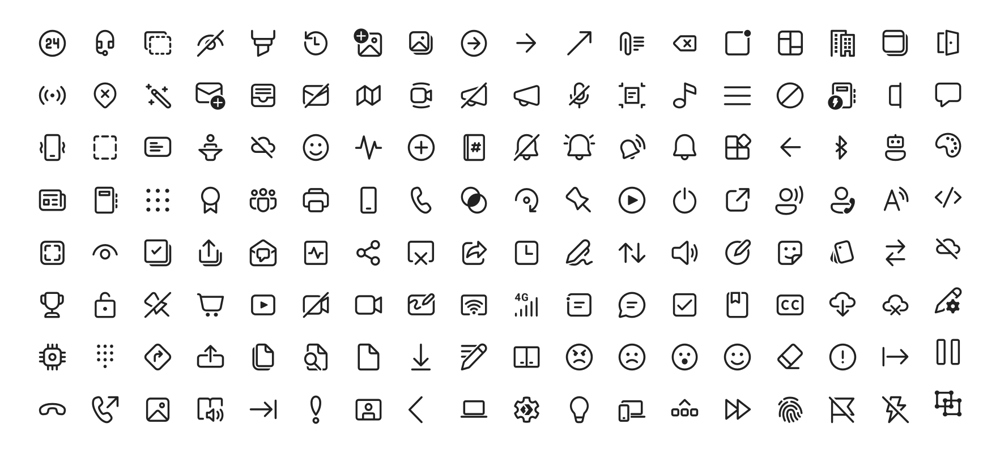

# Fluent UI System Icons


Fluent UI System Icons are a collection of familiar, friendly and modern icons from Microsoft.



## Icon List

- [View the full list of regular icons](icons_regular.md)

- [View the full list of filled icons](icons_filled.md)


## Direction
Within the metadata.json file for an icon, a property named `directionType` is used to indicate the direction of the icon. This property can have one of the following values:
- `unique`, meaning that the icon is unique and has a specific RTL and LTR version
- `mirror`, meaning that the icon can be mirrored for RTL or LTR languages

The property `singleton` is also used to indicate the default direction that should be used for the icon. 

## Installation

### Android

The library is published via Maven Central, please ensure that the `mavenCentral()` repository has been added to the root `build.gradle` file:

```groovy
repositories {
    ...
    mavenCentral()
}
```

Include the following dependency in your project's `build.gradle`:

```groovy
implementation 'com.microsoft.design:fluent-system-icons:1.1.251@aar'
```

For library docs, see [android/README.md](android/README.md).

### iOS and macOS

#### CocoaPods

```ruby
use_frameworks!

pod "FluentIcons", "1.1.251"
```

#### Carthage

```bash
git "git@github.com:microsoft/fluentui-system-icons.git" "1.1.251"
```

For library docs, see [ios/README.md](ios/README.md).

### Flutter

In the `pubspec.yaml` of your flutter project, add the following dependency:

```yaml
dependencies:
  ...
  fluentui_system_icons: ^1.1.251
```

For library docs, see [flutter/README.md](flutter/README.md).

### Plain svg

Inline svg directly. See [packages/svg-icons/README.md](packages/svg-icons/README.md).

## Contributing

### Importer

The importer generates the Android and iOS libraries from the icons in the `assets` directory.

Jump into the directory:

```
cd importer
```

Install npm dependencies:

```
npm install
npm run clean
```

List all the available commands:

```
npm run
```

### Build Pipeline

Our [build pipeline](https://github.com/microsoft/fluentui-system-icons/actions) runs `deploy:android` and `deploy:ios` to create the libraries. The build definitions are located in `.github/workflows/`.

## Demo apps

You can build and run the demo apps following the steps below.

### Android

1. Follow the **Importer** section above and run the command `npm run deploy:android`
2. Open the [android](android) directory in Android Studio
3. Select the `sample-showcase` in the build configuration dropdown
4. Click run

### Flutter

Prerequisite: Make sure you have flutter configured in Android Studio

1. Open the [flutter](flutter) directory in Android Studio
2. Select the `example` in the directory and open it in Android Studio
3. Click run

## Contact

Please feel free to [open a GitHub issue](https://github.com/microsoft/fluentui-system-icons/issues/new) and assign to the following points of contact with questions or requests.

- Jason Custer([@jasoncuster](https://github.com/jasoncuster)) / Spencer Nelson([@spencer-nelson](https://github.com/spencer-nelson)) / Joe Woodward([@thewoodpecker](https://github.com/thewoodpecker)) - Design
- Nick Romano([@rickromano](https://github.com/nickromano)) - iOS
- Will Hou([@willhou](https://github.com/willhou)) - Android
- Akashdeep Singh([@aakash1313](https://github.com/aakash1313)) - Flutter

## Code of Conduct

This project has adopted the [Microsoft Open Source Code of Conduct](https://opensource.microsoft.com/codeofconduct). For more information see the [Code of Conduct FAQ](https://opensource.microsoft.com/codeofconduct) or contact opencode@microsoft.com with any additional questions or comments.
