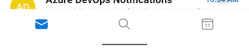

# Documentation

## Usage
The library offers icons in the form of Android `VectorDrawable`, the icon names are structured as: 
> `R.drawable.ic_fluent_[name]_[size]_[style]`

* `name` - Name of the icon from [assets](../assets) that is all lowercased and underscore separated.
* `size` - Size of the icon that is one of 16/20/24/28/48. Note that some icons do not have all sizes available yet. Our designers are working to add missing ones to complete the collection.
* `style` - Style of the icon that is one of `regular`, `filled` or `selector`. See the section below for details.

### Icon styles
The library offers icons in two styles, `regular` and `filled`

regular | filled
--------|-------
|

### Stateful icon selectors
Per the Fluent mobile design language, icons are by default in `regular` style and switched to `filled` style when active. An example is the icons in the bottom tab bar:



For convenience, the library offers drawable selectors of each icon to help achieve the above effect. The three active states supported are `state_activated`, `state_checked` and `state_selected`.

`ic_fluent_mail_24_selector.xml`
```xml
<selector xmlns:android="http://schemas.android.com/apk/res/android">
    <item android:drawable="@drawable/ic_fluent_mail_24_filled" android:state_activated="true"/>
    <item android:drawable="@drawable/ic_fluent_mail_24_filled" android:state_checked="true"/>
    <item android:drawable="@drawable/ic_fluent_mail_24_filled" android:state_selected="true"/>
    <item android:drawable="@drawable/ic_fluent_mail_24_regular"/>
</selector>
```

## Default color
The library assigns `#212121` as the default icon color. You can however, override it by adding a `fluent_default_icon_tint.xml` color selector to the `res/color` folder of your project and replacing the color value with a desired one. For example:
```xml
<selector xmlns:android="http://schemas.android.com/apk/res/android">
    <item android:color="#8E8E8E"/>
</selector>
```

## Right-to-left(RTL) support
When the device locale is set to a RTL language(e.g. Hebrew or Arabic), some direction-based icons, such as a left arrow, needs to be flipped. The library automatically inserts `android:autoMirrored="true"` to these icons, which allows the system to handle RTL layout mirroring for you. The list of icons that supports mirroring can be found in the [rtl.txt](../importer/rtl.txt) file.

## Tinting
With Android 5.0 (API level 21) and above, you can tint drawables with color resources or theme attributes that resolve to color resources. See the following sections to know how to apply a tint to different UI components that can host icons.

### ImageView
Use the `tint` attribute to apply color tint to an ImageView's drawable. Since the Android framework support for `tint` starts from **API21+**, the custom attribute namespace could be used for backwards compatibility.
```xml
<ImageView
    ...
    android:src="@drawable/ic_fluent_checkmark_24_regular"
    app:tint="@android:color/white"
    android:tint="@android:color/white"/> // OK to use just the framework one too since most MSFT apps are API21+

```
By code, use `ImageViewCompat` from the [AndroidX core library](https://developer.android.com/jetpack/androidx/releases/core):
```java
ImageViewCompat.setImageTintList(imageView, ColorStateList.valueOf(Color.WHITE));

// OK to use just the framework one too since most MSFT apps are API21+
imageView.setImageTintList(ColorStateList.valueOf(Color.WHITE));
```
### TextView compound drawable
Use the `drawableTint` attribute to apply color tint to a TextView's compound drawable icon. Since the Android framework support for `drawableTint` starts from **API24+**, the custom attribute namespace could be used for backwards compatibility.
```xml
<TextView
    ...
    android:text="Done"
    android:drawableStart="@drawable/ic_fluent_checkmark_24_regular"
    app:drawableTint="@android:color/white"/>
```
By code, use `TextViewCompat` from the [AndroidX core library](https://developer.android.com/jetpack/androidx/releases/core):
```java
TextViewCompat.setCompoundDrawableTintList(textView, ColorStateList.valueOf(Color.WHITE));
```

### Menu item icon
Use the `iconTint` attribute to apply color tint to a MenuItem's icon. Since the Android framework support for `iconTint` starts from **API26+**, the custom attribute namespace could be used for backwards compatibility.
```xml
<menu xmlns:android="http://schemas.android.com/apk/res/android"
    xmlns:app="http://schemas.android.com/apk/res-auto">
    <item
        android:id="@+id/menu_done"
        android:icon="@drawable/ic_fluent_checkmark_24_regular"
        android:title="Done"
        app:iconTint="@android:color/white"
        app:showAsAction="always"/>
</menu>
```
By code, use `MenutItemCompat` from the [AndroidX core library](https://developer.android.com/jetpack/androidx/releases/core):
```java
@Override
public boolean onCreateOptionsMenu(Menu menu) {
    ...
    MenuItem doneItem = menu.findItem(R.id.menu_done);
    MenuItemCompat.setIconTintList(doneItem, ColorStateList.valueOf(Color.WHITE));
    ...
}
```

### Drawable
Drawables can be tinted by using `DrawableCompat` from the [AndroidX core library](https://developer.android.com/jetpack/androidx/releases/core):
```java
Drawable icon = ContextCompat.getDrawable(this, R.drawable.ic_fluent_checkmark_24_regular);

// Tint drawable with a single color
DrawableCompat.setTint(icon, Color.WHITE);
// Tint drawable with a color state list
DrawableCompat.setTintList(icon, ContextCompat.getColorStateList(this, R.color.white_selector));
```

## Shrink resources
To maintain a lean app size by excluding any unused icons in build time, set the `shrinkResources` to `true` in your `build.gradle` file, as follows:
```groovy
buildTypes {
    release {
        shrinkResources true
        minifyEnabled true
        proguardFiles ...
    }
}
```
~~If you prefer to only exclude the Fluent icons, please save the [keep.xml](android/sample-shrinkresources/src/main/res/raw/keep.xml) file at your project's `res/raw` directory. Please see this [Android developer guide](https://developer.android.com/studio/build/shrink-code#shrink-resources) for details about shrinking resources~~