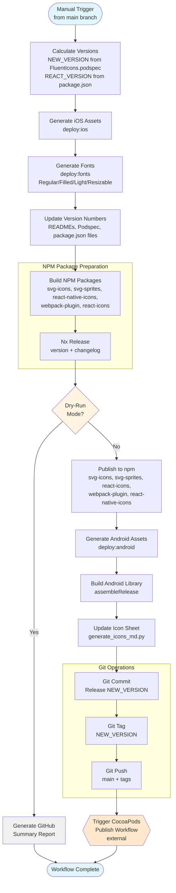

# Releases

This document describes the release process for Fluent UI System Icons across all platforms.

## Overview

The entire repository is released together via the [`.github/workflows/publish.yml`](../.github/workflows/publish.yml) workflow. Releases are **manually triggered** and must be initiated from the `main` branch.

## Release Strategy

### Versioning Scheme

- **Library-wide version**: `1.1.{Patch}` parsed from FluentIcons.podspec and auto-incremented
- **React packages version**: `2.0.{Patch}` parsed from packages/react-icons/package.json and auto-incremented patch version
- **Versioning approach**: Fixed release schema across the monorepo (all packages released together)

### Packages Released

The following packages are published during each release:

#### npm Packages

- `@fluentui/svg-icons` - Optimized SVG assets
- `@fluentui/svg-sprites` - SVG sprite files for on-demand usage
- `@fluentui/react-icons` - React Web SVG components inc font support
- `@fluentui/react-icons-font-subsetting-webpack-plugin` - Webpack plugin for font subsetting
- `@fluentui/react-native-icons` - React Native components

#### Platform-Specific Packages

- **iOS**: CocoaPods package (triggered separately via `cocoapods-publish.yml`)
- **Android**: Maven Central (currently disabled, builds only)
- **Flutter**: pub.dev package (currently disabled)

## Release cadence

- Releases are scheduled for every 2nd week by Design Team
- Releases can be triggered at any time in between if there is a high priority NPM package change that needs to be published (eg.: security vulnerability mitigation, critical fix etc)

## Release Process

### Prerequisites

- Write access to the `microsoft/fluentui-system-icons` repository
- Permissions to trigger GitHub Actions workflows
- Valid tokens configured in repository secrets

### How to Trigger a Release

- Go to https://github.com/microsoft/fluentui-system-icons/actions/workflows/publish.yml
- Click **Run workflow**
- Select branch: `main` (required)
- Optional: Check **dry-run** to simulate without publishing
- Click **Run workflow**

### Workflow Details

#### Workflow Diagram

The following flowchart illustrates the complete publish workflow:



#### Version Calculation

**Library version** (`NEW_VERSION`):

```bash
# Reads from FluentIcons.podspec, increments patch
# Format: major.minor.patch+1
```

**React version** (`REACT_VERSION`):

```bash
# Reads from packages/react-icons/package.json, increments patch
# Format: major.minor.patch+1
```

#### Changelog Generation

Some npm packages use **Nx Release** for version bump and changelog generation:

- Changelog generated based on **conventional commits** that modified `packages/{package-folder}/` only
- Uses workspace-wide git tags (`1.1.{number}`) rather than package-specific tags
- If no relevant changes found, defaults to: `"This release contains icon updates"`

> **Note**: `"projectsRelationship": "independent"` is configured in `nx.json` to filter commits to only those affecting `packages/{project}/`, even though the repo uses a fixed release schema.

### Dry-Run Mode

To validate a release without publishing:

1. Trigger workflow with **dry-run** checkbox enabled
2. Workflow will:
   - Calculate versions
   - Build all packages
   - Generate changelogs
   - Generates GitHub summary of what would be published
   - **Skip**: npm publishing, git commits, git tags, git push

## Pre-releases

- [react-icons prerelease publishing](../packages/react-icons/docs/prerelease.md)
