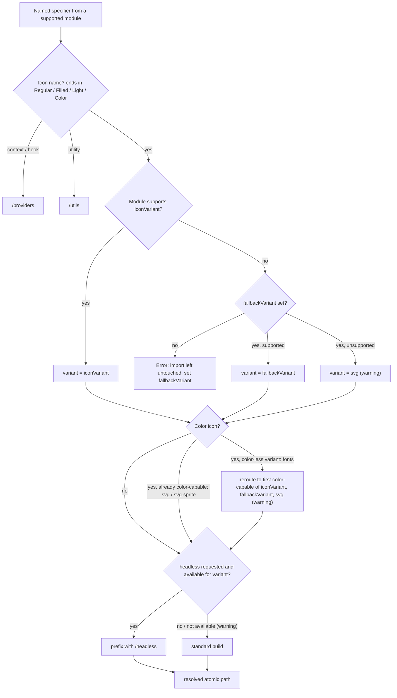

# @fluentui/react-icons-atomic-webpack-loader

> **⚠️ 0.x** — this package is in early development and follows [zero-based major semver](https://0ver.org/).
> Breaking changes may occur in minor releases until 1.0.

Webpack loader that transforms barrel imports and re-exports from `@fluentui/react-icons` and `@fluentui/react-brand-icons` into atomic deep paths for better tree-shaking and smaller bundles.

## Before / After

```js
// Before — barrel import pulls in the entire icon set
import { AddFilled, bundleIcon, useIconContext } from '@fluentui/react-icons';
import { ProjectColor } from '@fluentui/react-brand-icons';
export { ArrowLeftRegular } from '@fluentui/react-icons';

// After — each reference resolves to a small, isolated module
import { AddFilled } from '@fluentui/react-icons/svg/add';
import { bundleIcon } from '@fluentui/react-icons/utils';
import { useIconContext } from '@fluentui/react-icons/providers';
import { ProjectColor } from '@fluentui/react-brand-icons/svg/project';
export { ArrowLeftRegular } from '@fluentui/react-icons/svg/arrow-left';
```

## Usage

Add the loader to your webpack config as an [`enforce: 'pre'`](https://webpack.js.org/configuration/module/#ruleenforce) rule so it runs on the original source before any other loaders:

NOTE: Unlike most loaders, this one should NOT exclude `node_modules`. It needs to process files inside `node_modules` as well to transform barrel imports from `@fluentui/react-icons` and `@fluentui/react-brand-icons` in your third-party dependencies. Files that don't reference a supported module are skipped via a fast pre-check, so there is no meaningful overhead.

```js
// webpack.config.js
module.exports = {
  module: {
    rules: [
      {
        test: /\.[mc]?[jt]sx?$/,
        enforce: 'pre',
        use: ['@fluentui/react-icons-atomic-webpack-loader'],
      },
      // … your other rules (babel-loader, ts-loader, etc.)
    ],
  },
};
```

If your existing rules exclude `node_modules`, add a separate rule to cover dependencies:

```js
module.exports = {
  module: {
    rules: [
      {
        test: /\.[mc]?[jt]sx?$/,
        include: /[\\/]node_modules[\\/]/,
        enforce: 'pre',
        use: ['@fluentui/react-icons-atomic-webpack-loader'],
      },
      // … your other rules (babel-loader, ts-loader, etc.)
    ],
  },
};
```

## Supported modules

| Module                        | Variants                     | Headless       | Notes                         |
| ----------------------------- | ---------------------------- | -------------- | ----------------------------- |
| `@fluentui/react-icons`       | `svg`, `fonts`, `svg-sprite` | `svg`, `fonts` | Has `/providers` and `/utils` |
| `@fluentui/react-brand-icons` | `svg`                        | `svg`          | Has `/utils`; no `/providers` |

> **Color icons are SVG-only.** Color variants (`*Color`) rely on gradients that cannot be represented in an icon font, so they ship only in the `svg` and `svg-sprite` builds — never `fonts`. The loader reroutes color imports off font variants automatically (see [Color icons](#color-icons) below).

## Options

| Option            | Type                                   | Default     | Description                                                                |
| ----------------- | -------------------------------------- | ----------- | -------------------------------------------------------------------------- |
| `iconVariant`     | `'svg'` \| `'fonts'` \| `'svg-sprite'` | `'svg'`     | Variant icons resolve to. Applied to every supported module.               |
| `fallbackVariant` | `'svg'` \| `'fonts'` \| `'svg-sprite'` | `undefined` | Variant used for a module that does not support `iconVariant` (see below). |
| `headless`        | `boolean`                              | `false`     | Resolve to the headless (Griffel-free) build where the module ships one.   |

### Variant resolution & `fallbackVariant`

`iconVariant` is applied to every supported module referenced in a file. Because not every module ships every variant (for example `@fluentui/react-brand-icons` only ships `svg`), the loader resolves the variant per module:

1. If the module supports `iconVariant`, it is used.
2. Otherwise, if `fallbackVariant` is set and supported by the module, it is used.
3. Otherwise, if `fallbackVariant` is set but also unsupported, the loader emits a warning and falls back to `svg`.
4. Otherwise (no `fallbackVariant`), the loader fails with a descriptive error.

Resolution is lazy and per file: only modules actually imported in a given file are checked, so a file that imports only `@fluentui/react-icons` never errors about brand icons.

```js
// Resolve system icons to fonts, but keep brand icons on svg (their only variant).
{
  loader: '@fluentui/react-icons-atomic-webpack-loader',
  options: {
    iconVariant: 'fonts',
    fallbackVariant: 'svg',
  },
}
```

### Color icons

Color variants (`*Color`, e.g. `AddCircleColor`) are **SVG-only** — their gradients cannot be represented in an icon font, so the `fonts` build ships no color glyphs. When a color icon is imported under a color-less variant (`iconVariant: 'fonts'`), the loader reroutes just that import to a color-capable variant, following the same precedence as above (constrained to `svg` / `svg-sprite`), and emits a warning:

1. If `iconVariant` is already color-capable (`svg` / `svg-sprite`), the color import is left on it — no reroute, no warning.
2. Otherwise, if `fallbackVariant` is set and color-capable, it is used (e.g. `svg-sprite`).
3. Otherwise the loader falls back to `svg`.

Rerouting is per specifier, so color and non-color icons in the same statement resolve independently:

```js
// iconVariant: 'fonts'
import { AddFilled, AddCircleColor } from '@fluentui/react-icons';
// →
import { AddFilled } from '@fluentui/react-icons/fonts/add';
import { AddCircleColor } from '@fluentui/react-icons/svg/add-circle';
```

> Color icons are deprecated. See the [user guidance](https://microsoft.github.io/fluentui-system-icons/?path=/docs/icons-user-guidance--docs#color-variants-deprecated).

### Using font icons

```js
{
  test: /\.[mc]?[jt]sx?$/,
  enforce: 'pre',
  use: [
    {
      loader: '@fluentui/react-icons-atomic-webpack-loader',
      options: {
        iconVariant: 'fonts',
      },
    },
  ],
}
```

This changes icon resolution from `@fluentui/react-icons/svg/*` to `@fluentui/react-icons/fonts/*`. Non-icon exports (`utils`, `providers`) are unaffected.

> Color icons have no font build and are rerouted to `svg` (or `svg-sprite`) automatically — see [Color icons](#color-icons).

### Using the headless API

```js
{
  loader: '@fluentui/react-icons-atomic-webpack-loader',
  options: {
    iconVariant: 'fonts',
    headless: true,
  },
}
```

With the example above:

| Import              | Resolves to                                |
| ------------------- | ------------------------------------------ |
| `AddFilled`         | `@fluentui/react-icons/headless/fonts/add` |
| `bundleIcon` (util) | `@fluentui/react-icons/headless/utils`     |
| `useIconContext`    | `@fluentui/react-icons/providers` (shared) |

Notes:

- **Best-effort per module:** a module without a headless build for the resolved variant degrades to its standard (Griffel) implementation with a warning rather than failing the build. This applies to headless `svg-sprite` (not generated yet).
- **Version requirement:** headless `@fluentui/react-brand-icons` requires `>= 2.0.206`. The loader rewrites imports statically and does not check the installed version, so an older brand-icons will fail to resolve the `/headless/*` entries at build time.
- **Context is shared:** `useIconContext` / `IconDirectionContextProvider` always resolve to `@fluentui/react-icons/providers` — it is framework-agnostic and reused by both APIs.
- **CSS is your responsibility:** the loader only rewrites component/utility imports. You must still import the headless CSS in your app entry point:
  ```js
  import '@fluentui/react-icons/headless/styles.css';
  // and, for font icons:
  import '@fluentui/react-icons/headless/fonts/styles.css';
  ```

### Using SVG sprite icons

```js
{
  test: /\.[mc]?[jt]sx?$/,
  enforce: 'pre',
  use: [
    {
      loader: '@fluentui/react-icons-atomic-webpack-loader',
      options: {
        iconVariant: 'svg-sprite',
      },
    },
  ],
}
```

This changes icon resolution from `@fluentui/react-icons/svg/*` to `@fluentui/react-icons/svg-sprite/*`. Non-icon exports (`utils`, `providers`) are unaffected.

## How it works

The loader parses each module and rewrites import and re-export declarations that reference a supported module. Each named specifier is routed to an atomic subpath based on its name:

### Resolution flow

Each named specifier is resolved independently, so color and non-color icons — even within the same statement — can land on different variants.



> Steps marked "(warning)" emit a build warning — a best-effort degrade rather than a hard failure.

### `@fluentui/react-icons`

| Export type    | Example                                          | Resolved path                                                        |
| -------------- | ------------------------------------------------ | -------------------------------------------------------------------- |
| Icon component | `AddFilled`, `ArrowLeftRegular`                  | `@fluentui/react-icons/svg/add` (or `/fonts/add`, `/svg-sprite/add`) |
| Context / hook | `useIconContext`, `IconDirectionContextProvider` | `@fluentui/react-icons/providers`                                    |
| Utility        | `bundleIcon`, `createFluentIcon`                 | `@fluentui/react-icons/utils`                                        |

### `@fluentui/react-brand-icons`

| Export type    | Example                                   | Resolved path                             |
| -------------- | ----------------------------------------- | ----------------------------------------- |
| Icon component | `ProjectColor`, `CalendarTaskbar20Filled` | `@fluentui/react-brand-icons/svg/project` |
| Utility        | `bundleIcon`, `createFluentIcon`          | `@fluentui/react-brand-icons/utils`       |

Files that don't reference a supported module are passed through untouched (fast pre-check).

## Limitations

### Dynamic imports are not atomized

The loader only rewrites **static** `import` / `export … from` declarations. A dynamic `import()` of a barrel cannot be atomized, because the returned module-namespace object is a runtime value whose usage the loader cannot statically prove:

```js
// ⚠️ Not rewritten — the ENTIRE icon set is pulled into the async chunk.
const { AddFilled } = await import('@fluentui/react-icons');
React.lazy(() => import('@fluentui/react-icons'));
```

When it detects a dynamic import of a supported barrel, the loader emits a warning. Import the atomic path directly instead — then you lazy-load only the icons you use:

```js
// ✅ Only this icon lands in the async chunk.
const { AddFilled } = await import('@fluentui/react-icons/svg/add');
```

Alternatively, move the icons behind a local module that statically imports them; the loader atomizes that module, and only your lazy chunk pays for what it uses.

> The same applies to full-barrel subpaths (`@fluentui/react-icons/svg`, `@fluentui/react-icons/fonts`) — dynamically importing those also bundles the whole set. Always target a per-icon atomic path.

## Requirements

- `webpack` >= 5
- `@fluentui/react-icons` >= 2 (with atomic subpath exports)
- `@fluentui/react-brand-icons` (with atomic subpath exports), if used
  - `>= 2.0.206` when using `headless: true` — earlier versions do not ship the `/headless/svg/*` and `/headless/utils` entries, so the loader's rewritten imports will fail to resolve.
