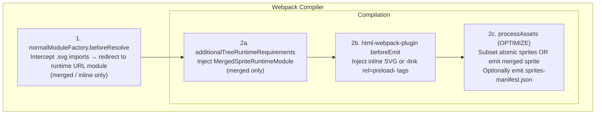
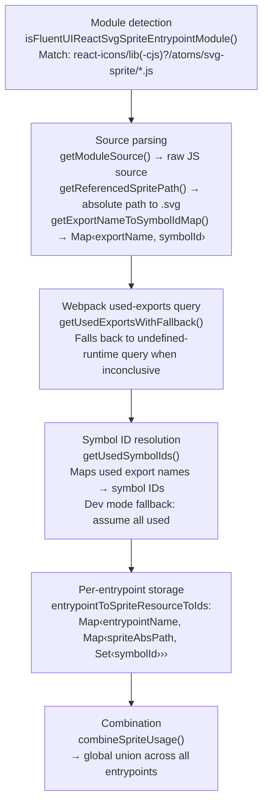
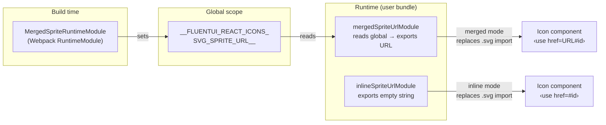
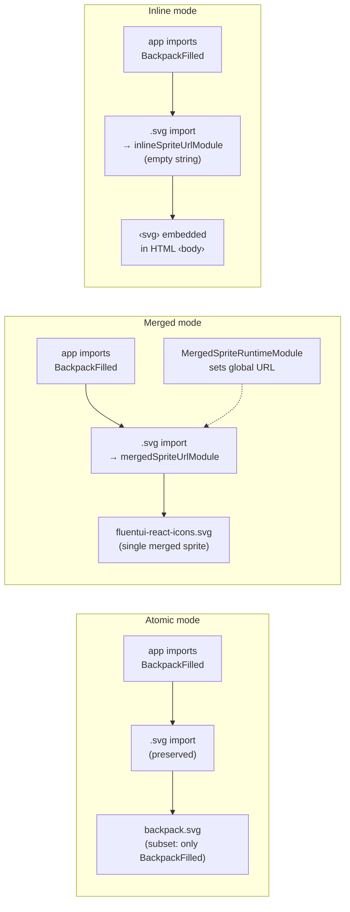

# Plugin Specification

> Internal documentation for contributors. For usage see [README.md](./README.md).

## Overview

The plugin optimises `@fluentui/react-icons/svg-sprite/*` entrypoints at build time by analysing which icon exports are actually used and stripping unused `<symbol>` elements from sprite SVGs.

It hooks into Webpack's module resolution, runtime injection, HTML template processing, and asset optimisation stages to achieve this across three operating modes: **atomic**, **merged**, and **inline**.

## Architecture



## Hook Lifecycle

### 1. `normalModuleFactory.beforeResolve`

**Condition:** `mode === 'merged'` OR `injectSpritesInTemplates.mode === 'inline'`.

Intercepts `.svg` import requests originating from `atoms/svg-sprite/` directories (matched by `ATOMS_SVG_SPRITE_DIR_PATTERN`). Rewrites the request to one of two runtime modules:

| Scenario          | Replacement module              | Exported value                        |
| ----------------- | ------------------------------- | ------------------------------------- |
| Inline injection  | `runtime/inlineSpriteUrlModule` | `''` (empty — symbols are in the DOM) |
| Merged (external) | `runtime/mergedSpriteUrlModule` | Public URL of the merged sprite asset |

In **atomic** mode this hook is **not** installed — original `.svg` imports are preserved and each sprite is emitted as a separate asset.

### 2a. `compilation.additionalTreeRuntimeRequirements`

**Condition:** `mode === 'merged'` AND **not** inline injection.

Registers `MergedSpriteRuntimeModule`, which emits Webpack bootstrap code that:

1. Computes the merged sprite's public URL (`__webpack_public_path__ + assetName`).
2. Stores it in a well-known global (`__FLUENTUI_REACT_ICONS_SVG_SPRITE_URL__`).

The companion `runtime/mergedSpriteUrlModule` reads this global at runtime and re-exports it as the default, so every icon component's `<use href="...">` points at the single merged sprite.

### 2b. `html-webpack-plugin.beforeEmit`

**Condition:** `injectSpritesInTemplates !== false` AND `html-webpack-plugin` is installed.

| `mode`      | Behaviour                                                                                                                                                 |
| ----------- | --------------------------------------------------------------------------------------------------------------------------------------------------------- |
| `inline`    | Builds a merged sprite from symbols used by the HTML page's entrypoints, strips the XML declaration, and injects it after the opening `<body>` tag.       |
| `reference` | Collects the public URLs of used sprite assets (atomic or merged) and injects `<link rel="preload" as="image" type="image/svg+xml">` tags after `<head>`. |

### 2c. `compilation.processAssets` (OPTIMIZE stage)

Performs the actual asset transformation:

- **Atomic mode:** Iterates each sprite SVG asset and removes `<symbol>` elements whose IDs are not in the used set (`subsetAtomicSprites`).
- **Merged mode:** Emits (or updates) a single merged sprite asset containing only used symbols from all sprite sources (`buildMergedSprite`).
- **Manifest:** When `generateSpritesManifest` is enabled, emits `sprites-manifest.json` with per-entrypoint usage data.

## Used-Exports Analysis

The core analysis runs during `processAssets` (lazily initialised and cached). It follows this chain:



### Entrypoint association

Each detected sprite module is associated with entrypoints via `chunkGraph.getModuleChunksIterable()`. If a module has no chunk assignment (edge case), it is conservatively attributed to **all** entrypoints.

### Fallback behaviour

When `optimization.usedExports` is disabled (common in development), `getUsedExports` returns `null` or a boolean. The plugin treats this as "all exports used" and keeps every symbol — no subsetting occurs but the build remains correct.

The `forceEnableUsedExports` option (default: `true`) mitigates this by setting `optimization.usedExports = true` when unset.

## Runtime Modules

Three files in `src/runtime/` support import rewriting and URL resolution at runtime:



### `MergedSpriteRuntimeModule.ts`

A Webpack `RuntimeModule` (stage `STAGE_ATTACH`) that generates bootstrap JS:

```js
var mergedSpriteUrl = __webpack_public_path__ + 'fluentui-react-icons.svg';
globalRef.__FLUENTUI_REACT_ICONS_SVG_SPRITE_URL__ = mergedSpriteUrl;
```

Runs at `STAGE_ATTACH` so that `__webpack_public_path__` is already initialised.

### `mergedSpriteUrlModule.ts`

Standalone module injected into the user bundle as a replacement for `.svg` imports in merged mode. Reads the global set by `MergedSpriteRuntimeModule` and re-exports it:

```ts
const url = (globalRef['__FLUENTUI_REACT_ICONS_SVG_SPRITE_URL__'] as string) ?? '';
export default url;
```

### `inlineSpriteUrlModule.ts`

Standalone module injected as a replacement for `.svg` imports in inline mode. Exports an empty string — since the `<symbol>` elements are embedded directly in the HTML, icon components only need a fragment reference (`#symbol-id`).

## Options Validation

Options are validated in two layers:

1. **Schema validation** (`options.schema.json`): JSON Schema enforced via `schema-utils` at construction time. Rejects unknown properties and validates types/enums.
2. **Semantic validation** (`normalizeOptions`):
   - `mergedSpriteFilename` is rejected when `mode !== 'merged'`.
   - Filename placeholders are restricted to `[fullhash]` and `[contenthash]`.
   - `injectSpritesInTemplates: true` normalises to `{ mode: 'inline' }`.

## Mode Comparison



| Aspect                          | Atomic                 | Merged                        | Inline                        |
| ------------------------------- | ---------------------- | ----------------------------- | ----------------------------- |
| SVG imports rewritten?          | No                     | Yes → `mergedSpriteUrlModule` | Yes → `inlineSpriteUrlModule` |
| Runtime module injected?        | No                     | `MergedSpriteRuntimeModule`   | No                            |
| Output assets                   | N subset sprite SVGs   | 1 merged sprite SVG           | None (embedded in HTML)       |
| HTML injection                  | Optional preload links | Optional preload link         | Inline `<svg>` in `<body>`    |
| Requires `html-webpack-plugin`? | Only for preload       | Only for preload              | Yes                           |

## Test Infrastructure

Tests live in `test/` and are driven by Webpack builds with a validation plugin:

```
test/
├── webpack.config.js         # Configurable via env vars
├── validation.js             # Constructor validation tests
├── src/
│   ├── atomic.js             # Entry: imports BackpackFilled, CalculatorFilled
│   └── merged.js             # Entry: same imports
└── __mock__/
    └── react-icons/lib/atoms/svg-sprite/
        ├── backpack.js       # 18 exports (various sizes/styles)
        ├── backpack.svg      # 18 <symbol> elements
        ├── calculator.js     # 6 exports
        └── calculator.svg    # 6 <symbol> elements
```

### What is validated

- **Atomic mode:** Each sprite asset contains only used symbols (e.g. `BackpackFilled` present, `BackpackRegular` absent).
- **Merged mode:** A single merged sprite contains only used symbols; no individual sprite assets are emitted.
- **Inline injection:** HTML contains the inline `<svg>` with used symbol IDs.
- **Reference injection:** HTML contains `<link rel="preload">` tags pointing to sprite assets.
- **Manifest:** `sprites-manifest.json` is emitted with correct entrypoint/symbol structure.
- **Constructor:** Rejects invalid option combinations (e.g. `mergedSpriteFilename` in atomic mode, unsupported placeholders).

### Running tests

```sh
# Full test suite (all modes)
npx nx run react-icons-svg-sprite-subsetting-webpack-plugin:test

# Individual test scripts
npm run test:atomic      # atomic mode build + validation
npm run test:merged      # merged mode build + validation
npm run test:inline      # inline injection build + validation
npm run test:reference   # reference injection build + validation
npm run test:validation  # constructor validation
```
